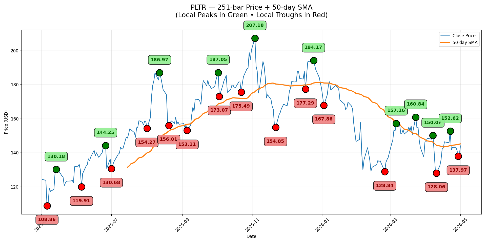

# stonks

Quick CLI for plotting stock price history with a simple moving average and
annotated local peaks and troughs. Backed by [yfinance](https://pypi.org/project/yfinance/)
for prices and [scipy.signal.argrelextrema](https://docs.scipy.org/doc/scipy/reference/generated/scipy.signal.argrelextrema.html)
for the extrema detection.



## Install

```sh
python3 -m venv .venv
source .venv/bin/activate
pip install -r requirements.txt
```

## Usage

### Basics

```sh
# Single ticker, defaults (365 days, 50-day SMA)
./stonks.py PLTR

# Tighter view: 3 months with a faster moving average
./stonks.py NVDA --days 90 --sma 20

# Multiple tickers — opens one chart per ticker
./stonks.py PLTR NVDA TSLA

# Save to PNG instead of showing interactively
./stonks.py PLTR --out pltr.png

# With multiple tickers and --out, the ticker is appended to the stem:
#   chart_PLTR.png, chart_NVDA.png, chart_TSLA.png
./stonks.py PLTR NVDA TSLA --out chart.png
```

### Tuning the peak/trough detection

`--order N` controls how strict `argrelextrema` is — a peak must be greater
than `N` neighbors on each side to qualify. Higher values surface fewer, more
significant turning points; lower values surface more noise.

```sh
./stonks.py PLTR --order 12   # only the biggest swings
./stonks.py PLTR --order 3    # every wiggle
./stonks.py PLTR --order 7    # default
```

### Comparing windows

```sh
# Year-over-year context with a slow SMA
./stonks.py SPY --days 730 --sma 200

# Recent volatility with a fast SMA and aggressive peak detection
./stonks.py TSLA --days 60 --sma 10 --order 3
```

## All options

| Flag        | Default | Description                                           |
|-------------|---------|-------------------------------------------------------|
| `tickers`   | —       | One or more ticker symbols (positional, required)     |
| `--days`    | 365     | Lookback window in days                               |
| `--sma`     | 50      | Moving-average window in days                         |
| `--order`   | 7       | Strictness of extrema detection (higher = fewer peaks)|
| `--out`     | —       | Save chart to file instead of displaying interactively|

## Notes

Prices are auto-adjusted (splits and dividends) by yfinance. Strict
`np.greater` / `np.less` are used so flat plateaus do not register as
extrema. Peaks are drawn in green, troughs in red, with the close-price line
in blue and the SMA in orange.
